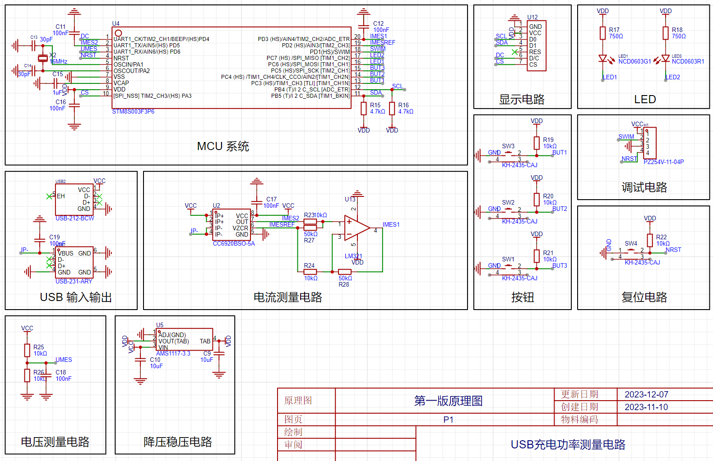
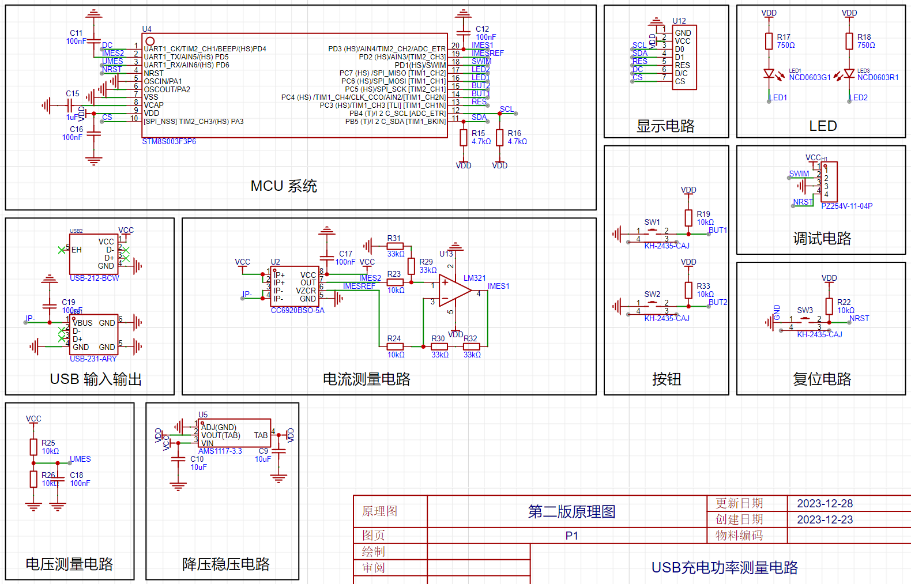
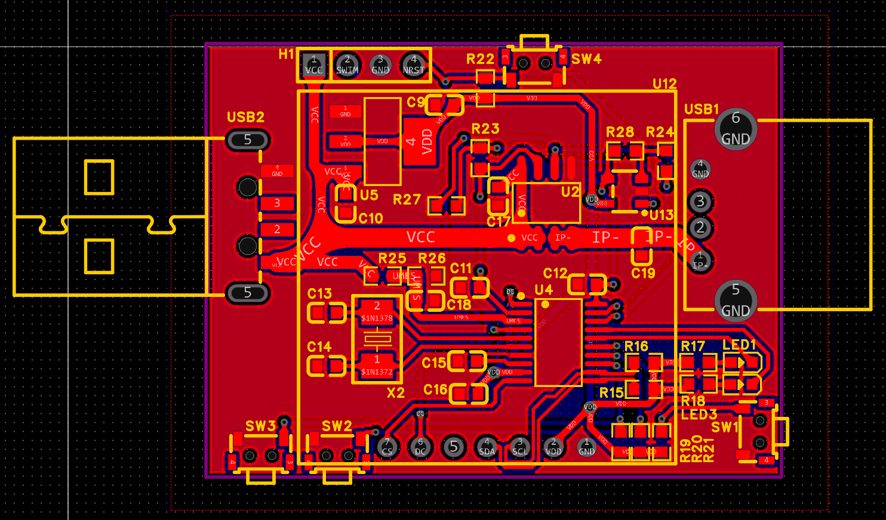
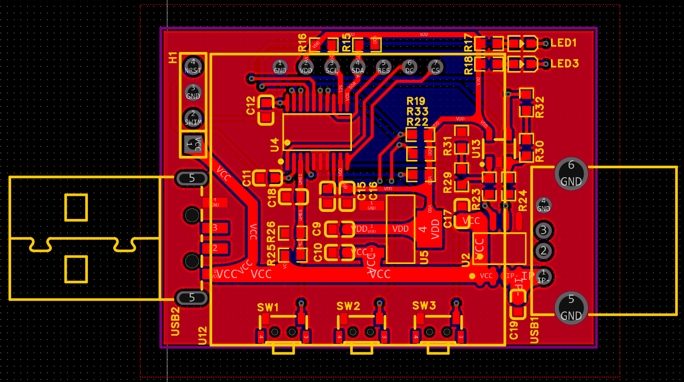

# USB 充电功率测量电路

本项目是一个硬件和软件解决方案，用于实时测量和显示 USB _充电_电路的功率特性。这是作为《硬件电路设计技巧与实训》课程项目而开发的。该系统测量 USB 电压和电流，计算功率，并将这些值以及历史功率图显示在 OLED 屏幕上。

## 主要功能 ✨

* **实时测量**：精确测量 USB 充电电压和电流值。
* **功率计算**：计算并显示瞬时功率。
* **OLED 显示**：在屏幕上显示电压、电流和功率的数值。
* **功率曲线模式**：显示历史功率数据图表（最多可存储和显示 32 个历史数据）。
* **用户交互**：两个轻触开关按键用于切换状态，一个复位按键。
* **状态指示**：若干 LED 灯指示工作状态和有效按键输入。

## 硬件组成 🔩

* **主控芯片 (MCU)**：STM8S003F3P6。
* **供电**：电路由 USB-A 公口提供 5V 电源，并输出到 USB-A 母口为用电设备供电。使用降压稳压芯片 AMS1117-3.3 转为 3.3V 电源并为 MCU、电流测量芯片供电。
* **电流测量**：
    * 霍尔电流传感器芯片：CC6920BSO-5A。
    * 运算放大器：LM321，用于在电流较小时放大运算结果以减少误差。
* **电压测量**：使用电阻分压。
* **显示**：0.96 英寸 OLED 屏幕。
* **用户输入**：轻触开关按键。
* **接口**：USB-A 公口（输入）、USB-A 母口（输出）。

## 软件设计 💻

软件设计分为驱动层设计与应用层设计。

* **驱动层设计**：
    * **ADC 驱动**：参考例程后自主编写，用于读取电压电流，并根据读取的管脚电平判断是否采取放大后的电流数据，同时在输出时添加了软件低通滤波。
    * **按键驱动**：参考例程后自主编写，检测到输入时使 LED 灯闪烁表示有效输入，同时设置了按键锁以避免连按输入。
    * **OLED 驱动**：自例程直接挪用而来。
    * **LED 状态灯驱动**：自例程直接挪用而来。
    * **延时驱动**：自例程直接挪用而来。
* **应用层设计**：
    * 完全自主编写显示代码。
    * 每次接到主函数的显示调用，自 ADC 驱动读取电压电流，并将循环队列中储存的功率历史数据更新。
    * 若调用为数字显示模式，则通过自主编写的显示浮点数的函数输出到屏幕上。
    * 若调用为功率图表显示模式，则通过自主编写的绘图函数输出到屏幕上，相邻数据间用直线连接。

## 系统调试与迭代 🛠️

项目经历了两个主要版本，解决了若干问题：

* **第一版电路问题**：
    * 同时使用 ST-LINK 与 USB-A 供电时疑似出现短路，ST-LINK 有不太明显的发烫。取消掉 ST-LINK 的供电后解决。
    * OLED 屏幕没有任何显示，因为在电路设计时直接将 OLED 的 RES 脚悬空了。通过将 RES 脚与调试电路的复位脚飞线连接解决，第二版电路中将该脚重新连到了单片机的一个引脚上。
    * 现有的电流测量电路的放大阈值（1A）不理想，且只利用了 ADC 转换范围的一半。
    * 设计了晶振电路，但实际上可以使用 MCU 内部自带的 RC 震荡电路，外部晶振性能优势不明显。第二版电路中删去。
    * 电压、电流、功率曲线的显示代码编写中遇到严重的存储空间不足问题。删去了电流、电压曲线，在历史数据量与存储空间中找到了平衡。
    * 电流数据的换算存在问题，电流与电压并非在整个量程上线性对应（应为264mV/A），导致了电流测量的系统误差，已在代码中调整。
* **第二版电路问题**：
    * 弄错了电流测量芯片的供电电压（应为3.3V而非5V），导致电流测量芯片的输出电压以5V为基准，但MCU侧以3.3V为基准解读，造成系统误差。通过飞线将该脚与3.3V电源相连解决。
    * 电流数据的波动仍然相对剧烈。示波器观察发现电流测量芯片输出信号及运放放大后信号噪声均较大。理论上设计的电容滤波未起作用，关键在于设计时没有串接一个电阻。软件低通滤波系数提高后效果显著提升，但也导致电流显示反应迟钝。

*（第一版和第二版 PCB 实物图请参考项目报告中的图6和图7）*

## 操作说明 📖

1.  上电后，显示欢迎界面。
2.  在欢迎界面按任意键（SW1或SW2）进入数字显示模式。
3.  SW1、SW2 两个按键均可以在数字显示模式与功率图表显示模式之间切换。
4.  有效输入会以绿色 LED 闪烁作标识。
5.  SW3 为复位按键。

## 改进方向 🚀

* 可采用更高精度的测量元件以提高准确度。
* 采用滤波器、接地等措施，减小外部干扰对测量电路的影响。
* 采用合理的电路布局和布线方式等。
* 根据 PCB 板外形设计 3D 外壳（初期计划，未完成）。

## 项目成员 🙏

* **陈廷峰**：元器件选型、原理图设计、电路焊接、程序编写和调试、项目报告撰写。
* **陈航安**：PCB 绘制、电路焊接、项目报告撰写。

## 课程与学习心得体会 🎓

本项目是《硬件电路设计技巧与实训》课程的一部分。主要学习收获包括：
* 提高了焊接技术，掌握了使用助焊膏、吸锡器辅助刀状电烙铁焊接及基础飞线技术。
* 掌握了基础原理图的设计与 PCB 的绘制，懂得了查询元器件数据手册等完成电路设计。
* 学会了使用示波器分析信号。
* 掌握了 STM8S 代码的编写，学会了使用 VSCode 配合 IAR 编写程序，使用 ST-LINK 下载程序，驱动 OLED 屏幕、读取按键状态、使用 ADC 外设。

